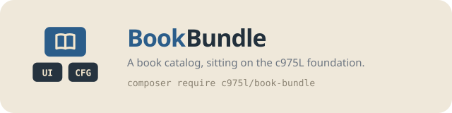

# BookBundle

Symfony bundle providing a publisher's catalog of books and series on the c975L core — media, video, press and marketing collections, EasyAdmin CRUD, paginated public routes, multilingual editions and its own sitemap.

[](https://github.com/975L/BookBundle/blob/master/LICENSE)
[](https://packagist.org/packages/c975l/book-bundle)
[](https://packagist.org/packages/c975l/book-bundle)
[](https://app.codacy.com/gh/975L/BookBundle/dashboard)

## Why BookBundle



Add BookBundle on top of the [c975L core](https://github.com/975L/CoreBundle) to get a publishing catalog — no dependency on SiteBundle, ShopBundle, SocialBundle or any other satellite bundle, so it drops into any c975L site that needs one. Media collections, admin CRUD and export reuse the core's shared mechanisms rather than duplicating them.

---

> **TL;DR** — A publishing catalog of books and series, each book carrying media, video, press and marketing sub-collections, with EasyAdmin CRUD, paginated public routes and a dedicated sitemap. Depends only on the c975L core, so it drops into any c975L site.

## Contents

- **Setup** — [requirements](#requirements) · [installation](#installation) · [configuration](#load-the-configuration) · [routes](#enable-routes) · [assets](#install-assets)
- **Using it** — [public routes](#routes) · [editions](#editions) · [customizing the catalog](#customizing-the-catalog) · [links](#links) · [ISBN filter](#isbn-filter) · [blocks](#blocks) · [structured data](#structured-data) · [sitemap](#sitemap) · [backup](#backup)

## Features

- Book and series catalog with paginated list and detail views
- Each book supports media, video, press, and marketing sub-collections with drag-and-drop ordering
- Series group books with sorted ordering
- Multilingual: books can reference translations across languages
- Each published form of a book — paperback, ebook, audiobook, illustrated edition — as a row carrying its own ISBN and release date
- Where a book is read, listened to or watched, as rows rather than columns — adding a platform is an enum case, not a migration
- What a single site adds to a book — its own fields, its own media and edition vocabulary — declared rather than coded into an overridden CRUD
- Admin CRUD via EasyAdmin for books and series
- Live component search for books
- Books, series and strips are composable in blocks, with the kinds of UiBundle
- schema.org `Book`, `BookSeries` and `ComicStory` data published as JSON-LD
- Sitemap generation, feeding the site's `llms.txt`
- Public url prefixes settable from the back office, and settable to nothing — a site reading its books under its own routes serves no page of the bundle's
- Guided projects and linkable routes contributed to the management interface
- Twig `isbn` filter for formatting ISBN numbers

---

## Requirements

- PHP >= 8.4
- [c975L/CoreBundle](https://github.com/975L/CoreBundle)
- Doctrine ORM
- EasyAdmin
- KNP Paginator Bundle
- symfony/ux-live-component
- symfony/ux-twig-component
- VichUploader Bundle

---

## Installation

### Download

```bash
composer require c975l/book-bundle
```

### Run migrations

```bash
php bin/console doctrine:migrations:diff
php bin/console doctrine:migrations:migrate
```

Upgrading from a version where a serie's covers were stored with no kind, tag them so they keep their `cover` kind:

```sql
UPDATE book_serie_media SET kind = 'cover' WHERE kind IS NULL;
```

### Load the configuration

The bundle ships the url prefixes of its public pages as ConfigBundle entries (group **Catalogue**):

```bash
php bin/console c975l:config:load-all
```

### Enable routes

Add the bundle routes to `config/routes.yaml`:

```yaml
c975_l_book:
    resource: "@c975LBookBundle/src/Controller/"
    type: attribute
    prefix: /
```

### Install assets

```bash
php bin/console assets:install --symlink
```

The `book_reader` kind ships a Stimulus controller, so its entrypoint has to be declared in the app's `importmap.php`:

```php
'@c975l/book-bundle/controllers.js' => ['path' => './vendor/c975l/book-bundle/assets/controllers.js', 'entrypoint' => true],
```

The bundle's own stylesheet (`public/css/styles.min.css`) is contributed to UiBundle's registry by
`Service\StylesheetProvider`, so nothing has to import it: `assets:install` is all it needs. It carries
shapes only — a book page is laid on the site's own ground and ink, read through UiBundle's
`--background`/`--text`/`--primary`, which the **theme** config group already feeds. What a design retunes
ships commented out in `scaffold/assets/styles/themes/book.css`, copied into the app once by
`c975l:scaffold:install` and owned by the app from then on.

---

## Usage

### Routes

| Route | URL | Setting | Description |
| --- | --- | --- | --- |
| `book_index` | `/livres` | `book-route-books` | Paginated book list |
| `book_display` | `/livre/{slug}` | `book-route-book` | Book detail page |
| `serie_index` | `/series` | `book-route-series` | Paginated series list |
| `serie_display` | `/serie/{slug}` | `book-route-serie` | Series detail page |
| `strip_index` | `/strips` | `book-route-strips` | Paginated strip list |
| `strip_character` | `/strips/character/{character}` | `book-route-strips` | Strips filtered by character |
| `strip_display` | `/strip/{slug}` | `book-route-strip` | Strip detail page |

The first segment of each url is a setting, group **Catalogue** in **Configuration**, so a site serves the
catalog in its own language — `books`, `libros`, `planches`. A route path is compiled into the router's
cache, so the prefix can't *be* the path: each route is declared as `/{book_prefix}/…`, carrying it as a
route parameter, and its condition asks `Routing\BookRoutePrefix` whether the segment it was handed is the
configured one. Any other value simply doesn't match and the router carries on with the rest of the site's
routes — without that check, `/{book_prefix}/{slug}` would swallow every two-segment url. Generating a url
needs nothing of this: `BookRoutePrefixListener` puts the prefixes in the router's request context, so
`path('book_display', {slug: …})` keeps taking the slug alone.

**Left empty, a setting takes its pages off the site altogether** — unlike GalleryBundle's own prefix, which
falls back to a default. That is what a site whose books are read under its own routes sets: papa-calin.com
reads them as `/histoire/{numéro}-{slug}`, from its own controller, and would otherwise serve every story at
two addresses competing for the same search result. The sitemap and the menu targets follow: a family whose
prefix is empty declares nothing (see `BookSitemapProvider`, `Management\LinkableRouteProvider`).

A site that turns a family off must not use that family's public components either (`Book:Book`,
`Serie:Serie`, `Strip:Card`…) nor the blocks built on them: they link to pages that are no longer served.

### Display pages

The three detail pages — a book, a serie, a planche — are laid out mobile first: one column, in source
order, and the wider steps are what a screen adds rather than what a phone has to undo. Each opens on a
hero carrying the page's only `h1`, which is why the templates leave the layout's own `title` block empty.

A book's and a serie's sections are named once, by `book_sections(book)` and `serie_sections(serie)`
(`Twig\BookSectionsExtension`), and the page reads that list twice: once to build its summary of anchors
(`<twig:c975LUi:Text:Toc>`, UiBundle), once to decide what to render. A section is therefore never offered
in the summary without being on the page, nor rendered without an anchor pointing at it — `resume`,
`apercu`, `extracts`, `shops`, `podcasts`, `presse`, `marketing`, `serie`, `informations` for a book,
`resume` and `books` for a serie. Each section wears UiBundle's `toc-target`, which leaves the room the
resting summary bar covers, so a jump doesn't land a title under it.

The summary is a bar of chips under the header on a phone and a column beside the sections from `1200px`
on; the labels come from the `book` translation domain, in the book's own language rather than the
visitor's. A planche gets the same skeleton with the one difference it asks for: what stays on screen is
the way to the next planche (`Strip:Navigation`, resting against the bottom of the viewport), not a summary
— a planche has one picture and a line or two around it.

Which versions a book holds is read off its editions rather than ticked by hand: `Book:Hero` prints one
badge per `BookEdition`, filled for one already out and outlined for one only announced, the word carrying
the information and the shape only repeating it. A version the book does not hold yet stays on the page:
for a reader that is an answer, not a gap.

Every template is overridable in `templates/bundles/c975LBookBundle/`. **A site overriding one of these
must check its props**: `Book:Videos`, `Book:Presses`, `Book:Marketings` and `Book:Serie` now take the
`book` itself rather than the collection, so they can print their own title in the book's language, and
`Book:Links` takes a `lang`. The language switch moved from `Book:Informations` to `Book:Hero`, beside the
title.

### Editions

A book is published in more than one form, and each has its own identifier: the paperback, the ebook, the
audiobook, the illustrated edition, the translation's own audiobook. They used to be three `isbn_*` columns
on the book, which said nothing of when each came out and could not hold a fourth. Each is a `BookEdition`
row now, the same move `BookLink` made for the stores:

```twig
{# every edition, out or announced #}

    {{ book_edition_label(edition) }} : {{ edition.isbn|isbn }}
    ({{ 'label.to_be_published'|trans({}, 'book') }})


{# one edition by name, and whether the book is out at all #}
{{ book.getEdition('audio')?.isbn }}
…
```

**An edition holds its own files and its own platforms** — the pages of the illustrated one, the recording sold as the audiobook, the stores selling it:

```twig
{# the pages of one edition, its own recording #}
…
{{ book.getEdition('audio').getLinks()|length }}
```

**Each edition is edited on a screen of its own** (`BookEditionCrudController`, reached from the book's own
form or from the "editions" action of the catalog). Its files and its platforms are added there, so no row
has to name the edition it belongs to — a flat list mixing the pages of two editions is what that choice
used to produce. Deleting an edition deletes them along with it.

**An edition with no date is not out**: an ISBN is reserved long before the book it names, and a page says
"à paraître" in its place rather than hiding the edition. `Book::isReleased()` is true as soon as any one of
them is out, which is what a catalog listing published books asks.

**Upgrading from the `isbn_*` columns** — the editions are minted from the columns, which are then dropped.
Adjust the kinds to the ones your site declares:

```sql
INSERT INTO book_edition (book_id, kind, isbn, published, position)
    SELECT id, 'paper', isbn_paper, published, 0 FROM book_book WHERE isbn_paper <> '';
INSERT INTO book_edition (book_id, kind, isbn, published, position)
    SELECT id, 'digital', isbn_digital, published, 1 FROM book_book WHERE isbn_digital <> '';
INSERT INTO book_edition (book_id, kind, isbn, published, position)
    SELECT id, 'audio', isbn_audio, published, 2 FROM book_book WHERE isbn_audio <> '';
```

### Customizing the catalog

What one site adds to its books is declared through `BookCustomizationProviderInterface`, not by overriding
`BookCrudController` — the screen stays the bundle's, and an app upgrading gets its improvements:

```php
namespace App\Management;

use c975L\BookBundle\Contract\BookCustomizationProviderInterface;

class BookCustomizationProvider implements BookCustomizationProviderInterface
{
    // The kinds of files this site's books hold, offered by the media form - none declared leaves the field out of it
    public function getMediaKinds(): array
    {
        return ['page' => 'Page', 'audio_mp3' => 'Audio MP3', 'trailer' => 'Bande-annonce'];
    }

    // The editions this site publishes - none declared falls back to the bundle's paper/digital/audio
    public function getEditionKinds(): array
    {
        return ['original_digital' => 'Originelle numérique', 'illustrated_paper' => 'Illustrée papier'];
    }

    // A plain form type mapped on Book::$data, holding the fields no other site has - null for a site adding none
    public function getDataFormType(): ?string
    {
        return StoryDataType::class;
    }
}
```

A label is passed to the translator, so it can be a key of the `book` domain as well as plain words: a
string the catalog holds no entry for is printed as it stands.

The fields of `getDataFormType()` are stored in `Book::$data`, one JSON payload rather than a column each —
same reasoning as UiBundle's `Block::$data`: what a single catalog needs is a form type it declares, no
schema migration for every app running this bundle. The form type is a plain one, mapped on the array:

```php
class StoryDataType extends AbstractType
{
    public function buildForm(FormBuilderInterface $builder, array $options): void
    {
        $builder->add('idea', TextType::class, ['label' => "L'idée de", 'required' => false]);
    }

    public function configureOptions(OptionsResolver $resolver): void
    {
        $resolver->setDefaults(['data_class' => null, 'empty_data' => []]);
    }
}
```

Read back by name, never as a raw key spelled out in a template: `book.getDataValue('idea')`.

**Anything the database itself has to filter, sort or join on stays a real column** — an ISBN is a
`BookEdition` row, a publication date is a column. `data` holds what only one site displays.

### Links

Where a book is read, listened to or watched is held by `BookLink`, one row per platform, rather than by a column per store as it used to be. The row holds the address itself and the platform as a plain string — the site's own vocabulary, the bundle's `BookLinkKind` standing in as the default catalog when a site declares none:

```twig
{# every store, every podcast platform, as its own card #}
<twig:c975LBook:Book:Shops book="{{ book }}" />
<twig:c975LBook:Book:Podcasts book="{{ book }}" />

{# or one platform, asked for by name #}
{{ book.link('epub_kobo').url }}
```

`url` holds the whole address, pasted as the platform hands it over, the way SiteBundle's `CollectionItem` holds one. What an address carries beyond the book — an affiliate identifier, a country, a format anchor, a podcast naming its show as well as its episode — belongs to the site and is kept that way, the bundle rebuilding nothing.

**Declaring your own platforms** — a site selling in a shop the bundle never heard of names it in its provider (see [customizing the catalog](#customizing-the-catalog)), each platform saying what it is called, which card it prints in (`epub`, `audio`, `podcast`, `video`) and the icon standing for it:

```php
public function getLinkKinds(): array
{
    return [
        'epub_bookshop' => ['label' => 'Bookshop', 'group' => 'epub', 'icon' => 'images/bookshop.svg'],
    ];
}
```

Declaring one replaces the bundle's catalog whole. A template reads a link through `book_link_label()`, `book_link_icon()` and `book_links_of(book, 'epub')` — the entity answers none of the three, the vocabulary being the site's and not the row's.

### ISBN filter

Format a raw ISBN string in Twig:

```twig
{{ book.isbn|isbn }}
{# Outputs: 979-10-92030-14-3 #}
```

### Blocks

`Book`, `Serie` and `Strip` implement UiBundle's `HasBlocksInterface`, so their pages are composed in the back-office with the kinds of UiBundle (`hero`, `text_section`, `image`, `slider`, `cta_band`…) — no template to write. The detail templates render the collection:

```twig
<twig:c975LUi:Blocks:Blocks blocks="{{ book.blocks }}"/>
```

A saved block moves from one container to another by drag and drop, `BookBlockOwnerResolver` being what lets UiBundle's move screen find the book, serie or strip holding it.

The bundle also ships five block kinds of its own. Four put a selection of the catalog on any page of the site — `book_series`, `book_books`, `book_to_be_published` and `book_serie_strips`.

The fifth, `book_reader`, reads an illustrated album page by page along its recording. Its medias are the album's pages in order, then the audio file; its `cues` say at which second of the recording each page is turned. The voice is the clock: it turns the pages, and a page turned by hand moves the playhead to that page's cue. Left without cues, the pages are turned by hand alone. It drives UiBundle's `slider` through the slider's own dots, so the two stay independent.

```twig
{# Outside a composed page - a story rendered from an entity, say - the component is called directly #}
<twig:c975LBook:Reader:Reader media="{{ pages }}" audio="{{ recording }}" id="reader" cues="{{ [{page: 1, start: 0}, {page: 2, start: 14.5}] }}"/>
```

### Structured data

A book's, a serie's and a strip's page publish their schema.org graph as JSON-LD, built by `BookSnippetBuilder` from the fields those pages already show: author, illustrator, language, publication date, page count, age range, one `workExample` per released edition, and the volume's rank in its serie (`isPartOf`/`position`, `hasPart` on the serie side).

An edition carries the ISBN, the release date and the page count of its own form, an audio one being an `Audiobook` rather than a `Book`, and the addresses of the platforms publishing it (`sameAs`). A translation is not an edition: it is a book of its own, paired with the one it translates through `translationOfWork` and `workTranslation`, at the url `BookPublicUrlResolver` spells for it.

A strip is a `ComicStory` — its characters, its rank in its serie and the address it first appeared at (`sameAs`) — where a book of that same serie is a `Book`, the two being read and indexed apart. One not published yet publishes nothing.

Overriding a display template keeps the markup, which is a Twig function rather than a template of its own:

```twig


    <script type="application/ld+json">{{ jsonLd }}</script>

```

`serie_json_ld(serie, ogImage, url)` and `strip_json_ld(strip, imageUrl, url)` are called the same way.

Price and availability are deliberately absent: they are an `offers` node, and they belong to whoever sells the book.

### Sitemap

The urls are declared by `BookSitemapProvider` (ConfigBundle's `SitemapProviderInterface`): index pages plus individual entries for all published books, all series, and all published strips. Nothing to register — the provider is picked up automatically.

Each one is built by `BookPublicUrlResolver`, which generates the path through the router and prefixes it with the configured `site-url`, so the sitemap declares the exact urls the routes answer to: it follows the prefixes of `BookRoutePrefix`, and leaves out a family whose prefix is empty — those pages are not served here at all. Nothing is declared before `site-url` is set, a sitemap accepting no relative url.

The bundle supplies urls and nothing else: `public/sitemap-book.xml` and the site's `public/sitemap-index.xml` are written by ConfigBundle, which collects every installed bundle's provider:

```bash
php bin/console c975l:sitemaps:create
```

That's the one to schedule — it is also the "Create sitemaps" shortcut of the dashboard.

Those same urls are also **health-checked** for free, with `c975l/site-bundle` installed: every declared url gets the content-quality checks (title/description length, missing `<h1>`, Open Graph share tags, images without `alt`, broken links) under its own `urls-book` kind on the Health check dashboard, schedulable apart from the rest:

```bash
php bin/console c975l:health-check:run --kind=urls-book
```

The same provider carries the `title` and `description` ConfigBundle's `SeoFilesWriter` builds `public/llms.txt` from — a `## Book` section listing the indexes, the published books and the series. A strip's page carries no title there on purpose, an index of plates being what the sitemap already is.

### Backup

`BookBackupPathProvider` declares `public/medias/book` to ConfigBundle's backup, which mirrors it off-server: the covers, extracts, press clippings and marketing files are the only content of this bundle that neither a git clone nor a database dump brings back. Nothing to register.

---

> [!TIP]
> If this project **helps you save development time**:
>
> - [**star** it on GitHub](https://github.com/975L/BookBundle) — helps others find it
> - [**open an issue**](https://github.com/975L/BookBundle/issues/new) to share how you use it — genuinely useful feedback
>
> And if you'd like to support the work directly, the **Sponsor** button at the top of the GitHub page is there for that. Thank you!
